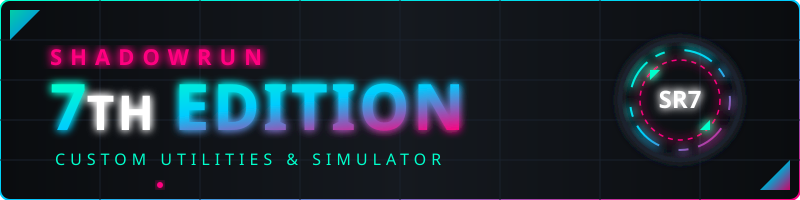
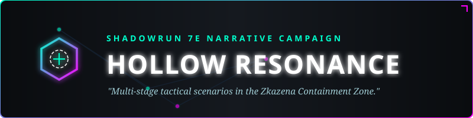
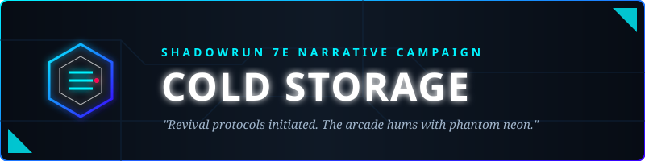
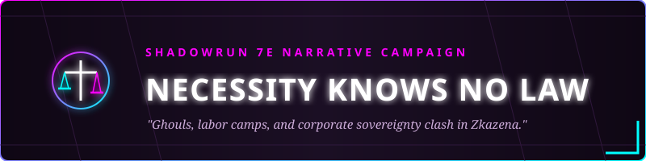
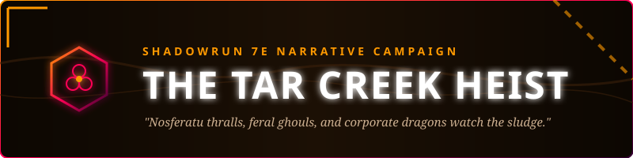

# Shadowrun 7E Custom Tools & Campaigns

<p align="center">
  
</p>

This repository contains fan-made rules, tools, and campaign notes for a custom Shadowrun 7th Edition ruleset centered around the "Hollow Resonance" campaign setting in Zkazena.

## Features

* **Custom Shadowrun 7th Edition Ruleset:** Comprehensive fan-made rules including custom weapons, qualities, magic, Matrix, and rigging rules.
* **Autonomous LLM Combat Simulation:** A fully-featured Python combat simulator that runs turn-based combat using an OpenAI-compatible LLM to make tactical decisions and generate gritty flavor text.
* **Pygame Visual UI:** A dynamic graphical interface for the combat simulator, rendering ASCII map grids, blast zones, and character cards with health bars and portraits.
* **Chummer Integration:** Tools to automatically generate and merge custom Chummer 5e XML files from Markdown rules, and native support for parsing `.chum5` character files into the combat simulator.
* **Automated Game Balancing:** Scripts to automatically calculate Nuyen/Karma costs for weapons and qualities using mathematical baseline formulas, directly editing Markdown tables in-place.
* **LaTeX Rulebook Generation:** Tools to compile the Markdown rules into a formatted LaTeX document and PDF.
* **Narrative & Novella Generation:** AI-assisted scripts to draft chapter-by-chapter novellas based on GM outlines and campaign lore.
* **Narrative Module System:** Execute multi-stage campaign scenarios chaining multiple combat simulations together.
* **Trade Simulator:** Haggling mechanics simulation for buying/selling gear using social dice pools.

---

## Active Campaigns

This project includes multiple rich storytelling campaigns, each featuring distinct, high-quality, custom SVG identities:

* **Hollow Resonance (Default Demo Campaign)**
  <br/>
  

* **Cold Storage Campaign**
  <br/>
  

* **Necessity Knows No Law Campaign**
  <br/>
  

* **The Tar Creek Heist Campaign**
  <br/>
  

---

## New & Advanced Features

### 1. Advanced Matrix Host Architecure Simulation (`--host-run`)
This mode simulates complex nested host architectures within the combat simulator. Hackers must interface with HostNode structures, each with its own rating, security level, and connected systems, while evading the host's alert level and active security countermeasures (IC / ICE).

### 2. Astral Combat Plane & Spirits
The combat simulator now tracks plane states (`PHYSICAL`, `ASTRAL`, `MATRIX`) and enforces Astral Combat rules. Astral entities roll Initiative using `REA + INT + 1D6 + MAG` and target other Astral/Dual-Natured combatants using Willpower + Astral Combat, soaking with Willpower.

### 3. Vehicle Chase Minigame UI
The Pygame graphical interface features a dedicated high-speed chase visualization screen. It dynamically displays the relative distance with progress bars, hazard tracks, and lets player character cards perform active **RAM** and **EVADE** actions to escape or damage enemy vehicles.

### 4. Economy & Black Market Trade UI (`TradeScreen`)
Simulates intense haggling mechanics directly from the Overworld Map. GMs/Hosts can broadcast a live Negotiation test (Buyer's CHA + Negotiation + Street Cred vs Fixer's WIL + Negotiation + Difficulty) to compute custom nuyen pricing under a global campaign economy multiplier.

### 5. Tactical State Checkpoints & Save/Load UI (`SaveLoadScreen`)
Allows players and GMs to save real-time combatant statuses (including physical/stun damage, remaining Edge, nuyen balances, faction standings, and weapon/contact arrays) to JSON state files under the `campaign_state/` directory and restore checkpoints mid-game via an interactive State Manager screen.

### 6. "Gun-Fu (Flow State)" and Stealth Phases
Support for specialized pre-combat **Stealth and Infiltration Phases** to bypass nodes or hack ahead, plus technomancer abilities like **Flow State** (yielding bonus queued action opportunities upon downing a target).

---

## Tools Included

### 1. Autonomous Combat Simulator (`combat_simulator.py`)
This tool runs a fully autonomous, turn-based combat simulation between two teams/squads. It utilizes the custom D6 ruleset and interfaces with a local OpenAI-compatible LLM to roleplay the encounter, make tactical weapon choices, and narrate gritty Shadowrun combat flavor text.

**Features:**
* Parses character sheets from `.chum5` XML files.
* Parses inline NPC stat blocks from Markdown files (e.g., `GM Notes/GM_Campaign_Guide.md:Sargent Igneous`).
* Ingests JSON scenario files for environmental context and map data.
* Outputs a turn-by-turn narrative log, final health summary, and randomized loot drops.
* Saves updated character states (Damage, Edge, Life Status) to a JSON scratchpad in the `campaign_state/` directory, making it easy to track character progression with Git.
* Supports a visual Pygame interface (`--ui`) with dynamic combatant tracking cards.
* Supports an interactive mode (`--interactive`) that pauses for manual input and UI clicks (attacks, spells, data spikes, etc.).

**Usage:**

```bash
# Basic usage with two Chummer XML files
python scripts/combat_simulator.py --team1 npc_templates/Cryptolock.chum5 --team2 npc_templates/god_antibody.chum5

# Usage with a specific NPC from a Markdown file
python scripts/combat_simulator.py --team1 "GM Notes/GM_Campaign_Guide.md:Sargent Igneous" --team2 npc_templates/feral_fuchsia_dragon_abomination.chum5

# Load a specific scenario for the LLM to use (e.g., Tar Creek Ambush)
python scripts/combat_simulator.py --team1 npc_templates/Kyber.chum5 --team2 npc_templates/wuxing_null_sec_strike_team.chum5 --scenario campaigns/default/scenarios/tar_creek_ambush.json

# Test mechanical output without calling an LLM (uses generic default actions)
python scripts/combat_simulator.py --team1 npc_templates/Cryptolock.chum5 --team2 npc_templates/god_antibody.chum5 --dry-run

# Squad combat with visual UI and manual inputs
python scripts/combat_simulator.py --team1 npc_templates/Cryptolock.chum5 npc_templates/Kyber.chum5 --team2 npc_templates/god_antibody.chum5 npc_templates/wuxing_null_sec_strike_team.chum5 --ui --interactive
```

**LLM Configuration:**
By default, the script points to a locally hosted endpoint at `http://localhost:8000/v1`. You can override this using CLI arguments:
```bash
python scripts/combat_simulator.py --team1 <paths> --team2 <paths> --llm-url "https://api.openai.com/v1" --llm-model "gpt-4o"
```

### 2. Combat Analyzer (`combat_analyzer.py`)
This tool runs the mechanical combat simulation from `combat_simulator.py` headless and repeatedly to gather statistics. It utilizes a `DummyAgent` for decision-making so it is purely mechanical, extremely fast, and completely free to run. Use this tool to balance weapons, test character builds, and verify stat differences.

**Usage:**
```bash
# Run 100 iterations between two combatants
python scripts/combat_analyzer.py --team1 npc_templates/Cryptolock.chum5 --team2 npc_templates/god_antibody.chum5 --iterations 100
```

### 3. NPC Tournament (`tournament.py`)
This tool reads all `.chum5` character files from the `npc_templates/` directory and simulates a full round-robin combat tournament. It pits every character against every other character for 100 iterations and computes a final leaderboard based on wins, draws, and losses.

**Usage:**
```bash
# Run the tournament and generate tournament_results.md
python scripts/tournament.py
```

### 4. Balance Generator (`balance_generator.py`)
Rewrites markdown tables in-place to calculate balanced Nuyen/Karma costs using explicit constants reflecting the 'Balancing Baseline Formulas'.

### 5. XML Generator (`xml_generator.py`)
Extracts game objects (weapons, qualities) from the Markdown rules and merges them into existing Chummer-compatible XML files within the `chummer_plugin/` directory.


### 6. Module Runner (`run_module.py`)
This tool executes multi-scenario narrative modules, chaining together sequential stages of combat simulation. It reads module definitions from JSON files and automatically progresses through different scenarios, supporting distinct environments and enemy team loadouts per stage.

**Usage:**
```bash
# Run a campaign module with your player characters
python scripts/run_module.py --module modules/hollow_resonance_part1.json --team1 npc_templates/Cryptolock.chum5 npc_templates/Kyber.chum5 --ui --interactive
```

### 7. Rules Analyzer (`analyze_rules.py`)
This tool parses the `Fan made Shadowrun 7th Edition rules.md` file using a Markdown parser to analyze and extract structured data, such as custom Qualities and Markdown table stats. It is primarily used internally by other pipeline scripts (like the XML or balance generators).

**Usage:**
```bash
python scripts/analyze_rules.py
```

### 8. Novella Generator (`generate_novella.py`)
This script uses an LLM to automatically generate narrative prose (like novellas or campaign background) based on a provided outline markdown file (`GM Notes/novella_outline.md`). It adheres to specific thematic instructions and 'show, don't tell' styling, generating gritty cyberpunk-horror text.

**Usage:**
```bash
python scripts/generate_novella.py
```

### 9. PDF Generation Pipeline (`generate_pdf.sh`)
This script automatically compiles the Markdown rules (`Fan made Shadowrun 7th Edition rules.md`) into a formatted LaTeX document and PDF using Pandoc. It leverages a custom LaTeX template (`scripts/template.tex`) and a Lua filter (`scripts/multicols.lua`) to ensure the entire rulebook—text, headers, and tables—is correctly styled and structured in a two-column layout.

**Usage:**
```bash
./scripts/generate_pdf.sh
```

*(Note: The legacy script `scripts/update_latex_from_md.py` is deprecated in favor of this new Pandoc pipeline.)*

## Setup and Installation

It is highly recommended to use a Python virtual environment to manage dependencies and avoid version conflicts (such as issues with the `openai` and `httpx` packages).

**Automated Setup:**
You can run the included setup script to automatically create a virtual environment and install all requirements:
```bash
chmod +x setup.sh
./setup.sh
```

**Manual Setup:**
```bash
# 1. Create a virtual environment named 'venv'
python3 -m venv venv

# 2. Activate the virtual environment
# On Linux/macOS:
source venv/bin/activate
# On Windows (Command Prompt):
venv\Scripts\activate.bat
# On Windows (PowerShell):
venv\Scripts\Activate.ps1

# 3. Install the required dependencies
pip install -r requirements.txt
```

---
